# Farmony

## Planning
## User Stories

### As a farmer member:

- I want to find help, sell and trade crops/food that I have grown on my farm.
- I can connect to my local community and spread awareness about my farm. 
- I can create posts specific to my needs and communicate with other users.

### As a farmhand member:

- I want to connect to my local community.
- I can offer help, buy/ trade affordable food and learn about my local farms and their crops/food.
- I can create posts specific to my needs and find farmers and other users close-by who can help me find what I am looking.

### As a non-member:

- I want to do a simple browse to find a farm I can check out.
- I can browser urban farms near me. I can not send messages to farmers or write posts.

#### About Us

The health and wellness industry is currently valued at 4.5 trillion dollars for a reason.  It’s hard not to notice that being healthy today seems to come with a hefty price tag. The purpose of Farmony is to ensure that no one has to go broke to get healthy. Farmony is a social media website for those looking to cut the middle man out of their shopping and buy locally, straight from the source.  Users can buy or trade products with one another, offer or seek help at urban farms, trade recipes or just learn about the farmers in their area. 

## database Setup

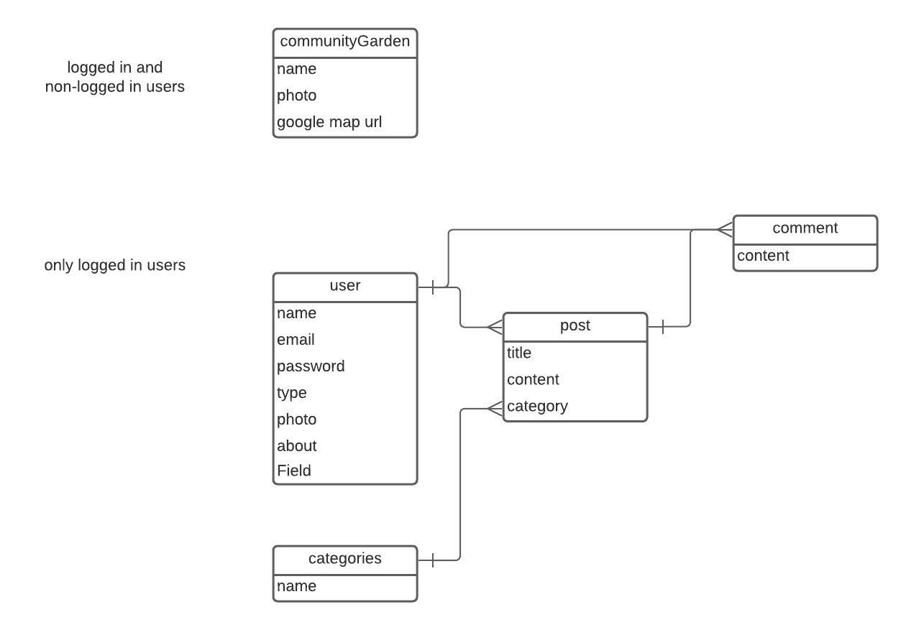

## Wireframe

#### 1
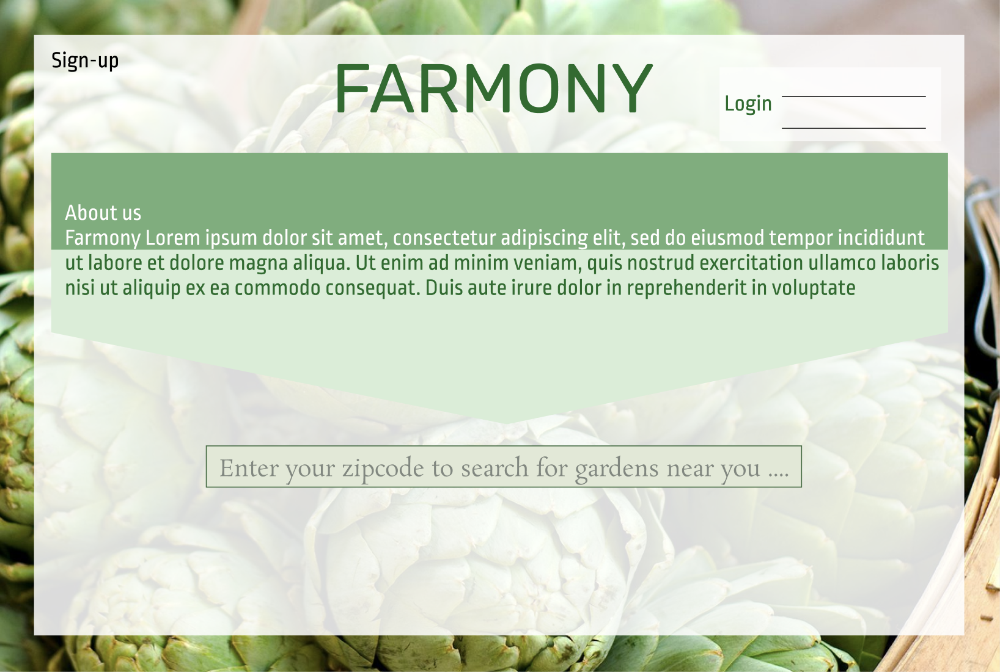

#### 2
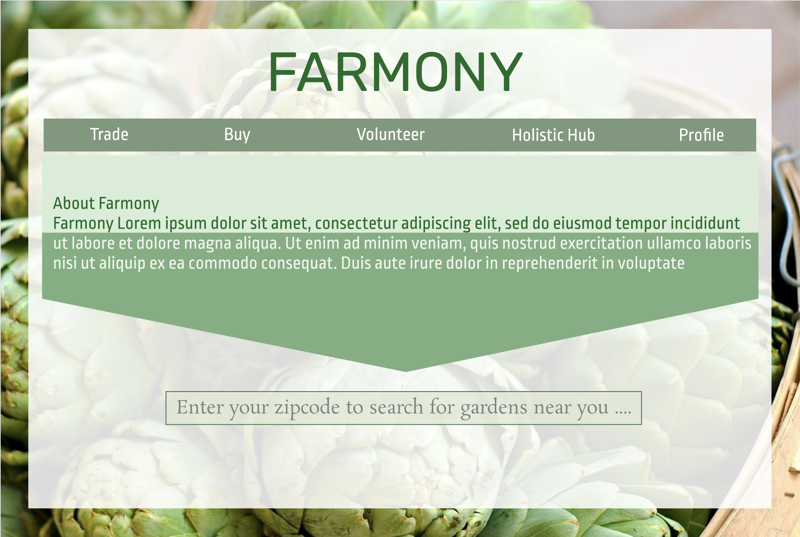

#### 3
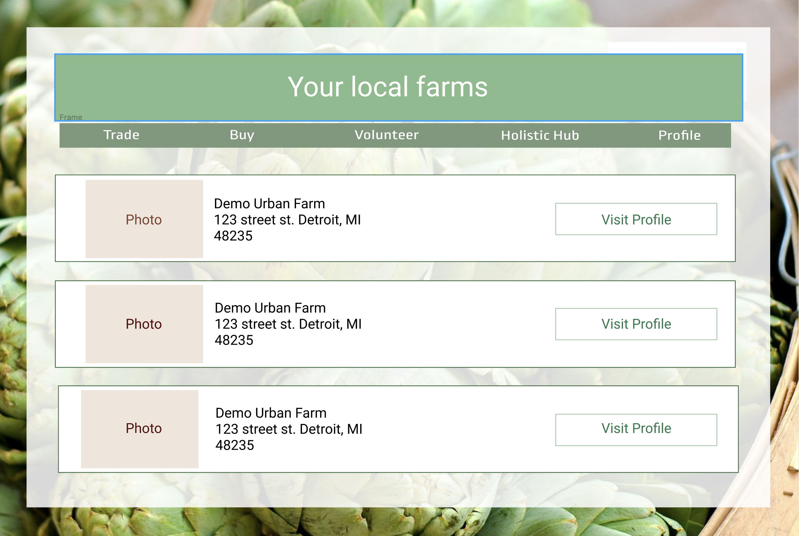

#### 4
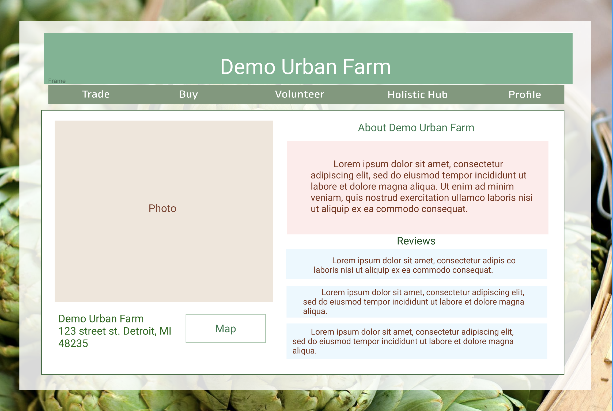

#### 5
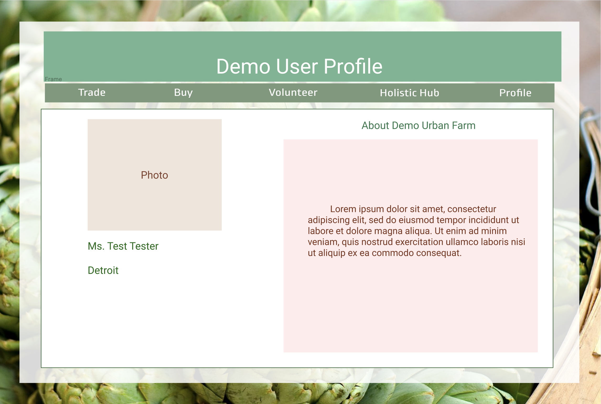

#### 6
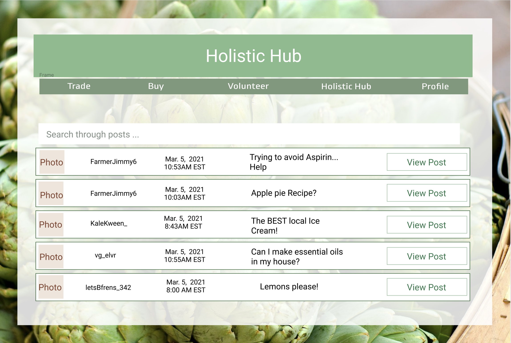

#### 7
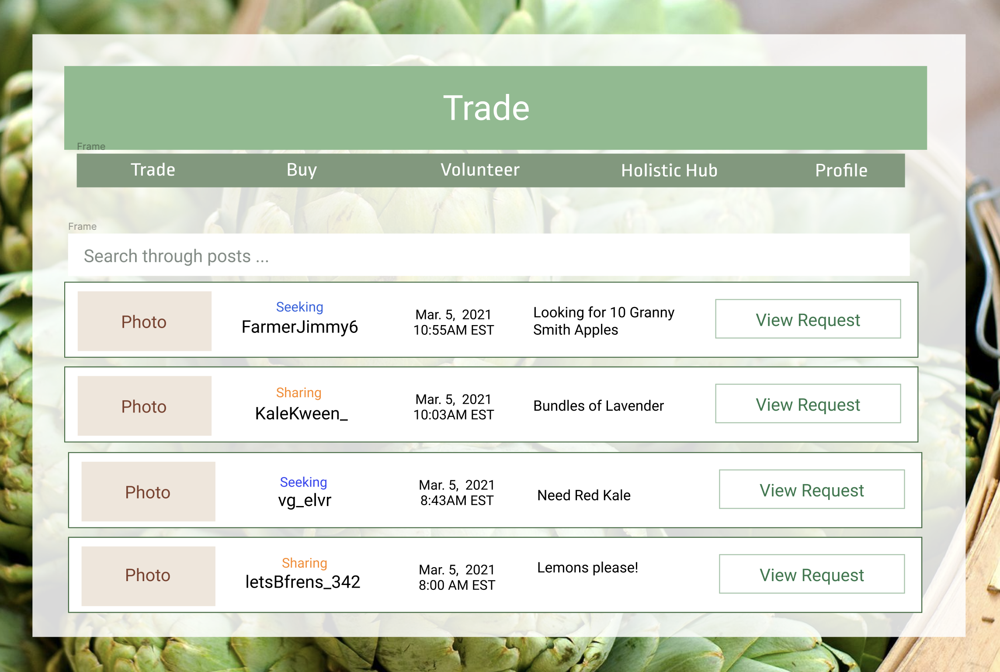

#### 8
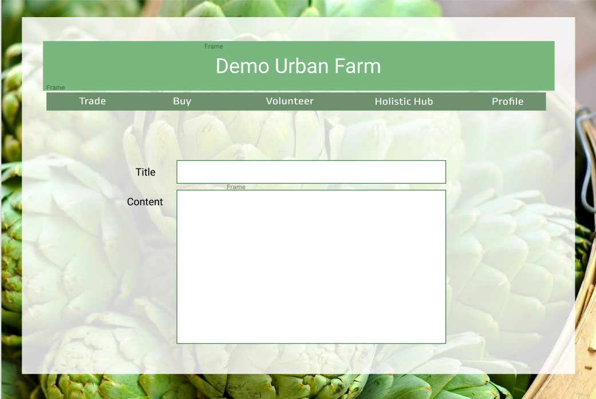

#### 9
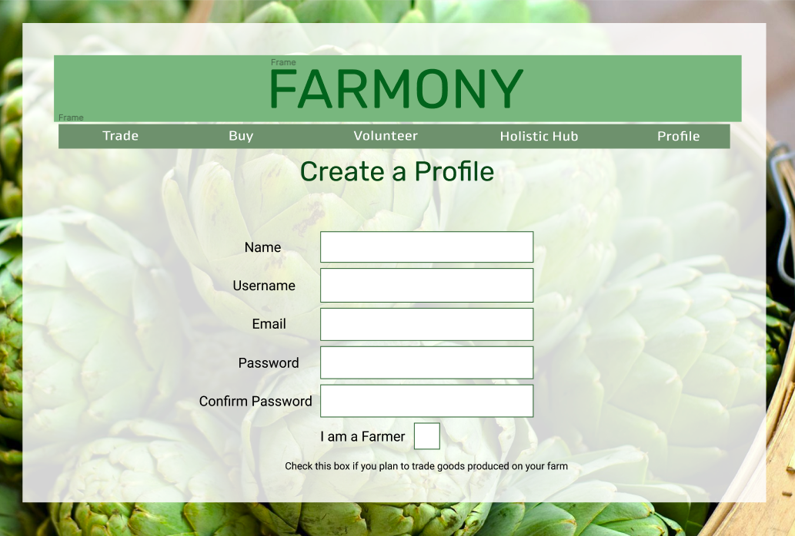

#### 10
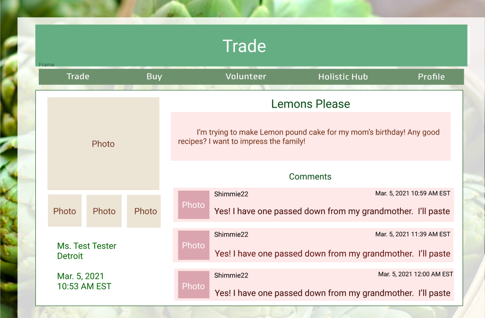
