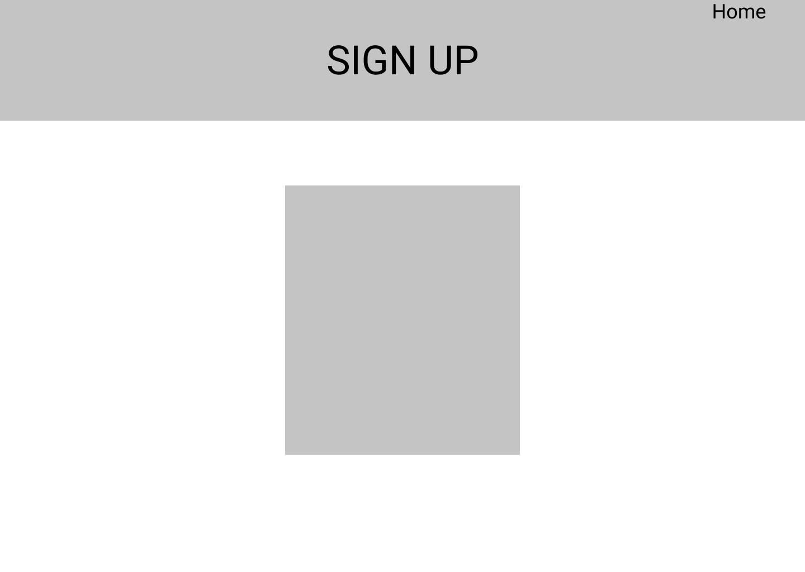
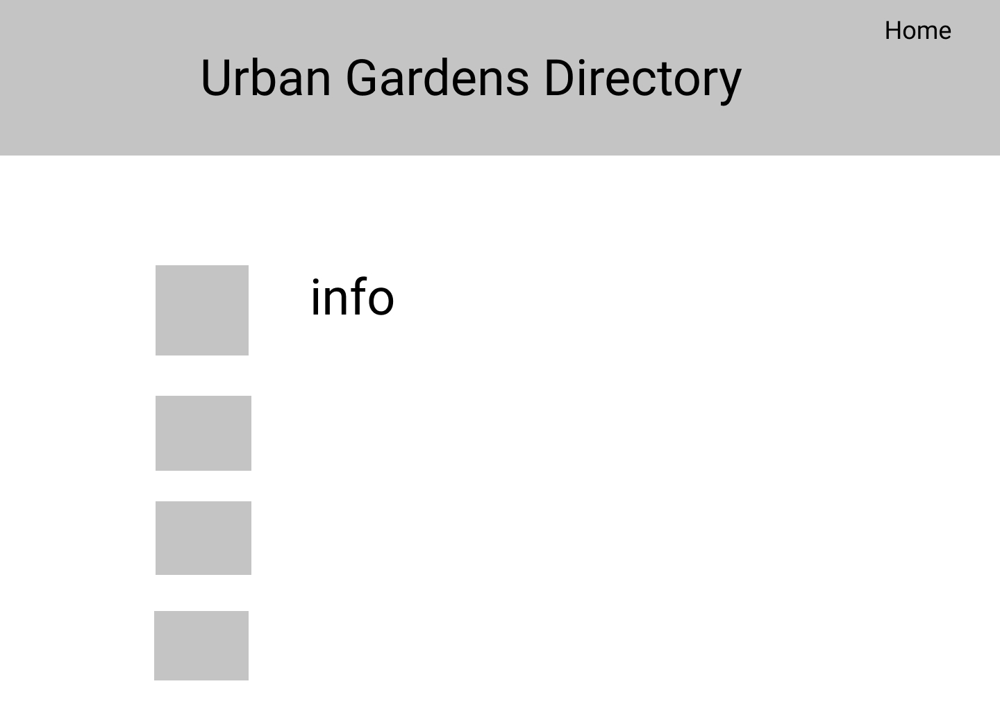
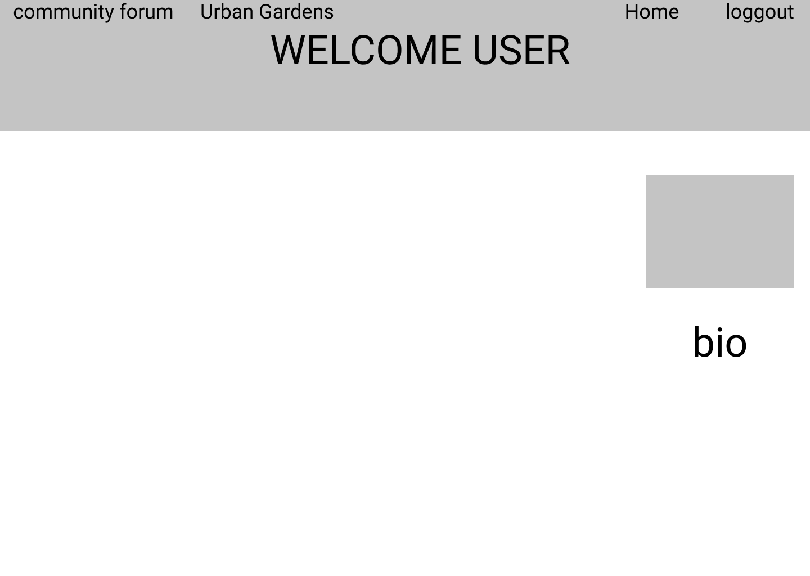
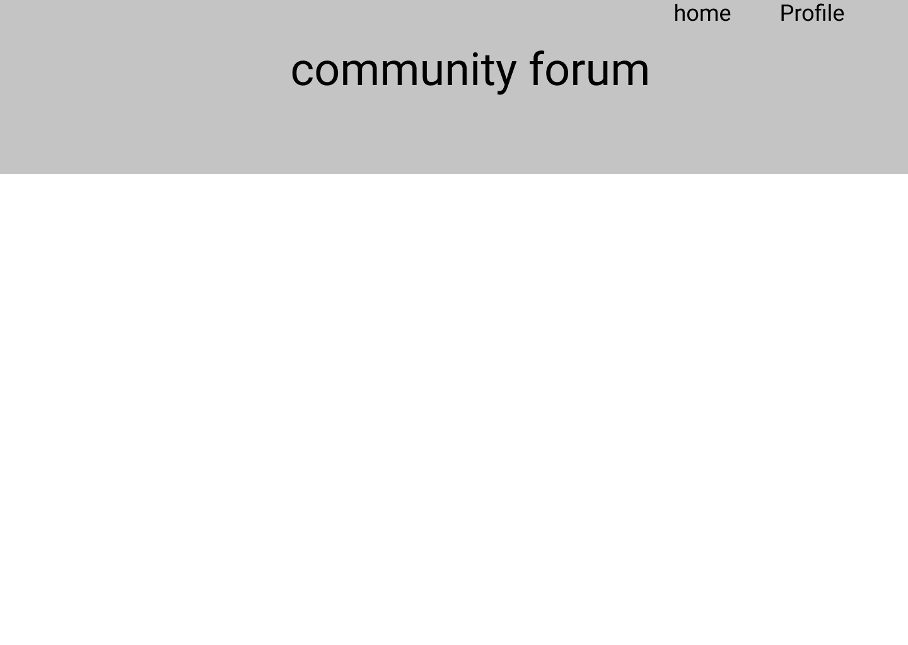

# Farmony

## Planning
## User Stories

### As a farmer member:

- I want to find help, sell and trade crops/food that I have grown on my farm.
- I can connect to my local community and spread awareness about my farm. 
- I can create posts specific to my needs and communicate with other users.

### As a farmhand member:

- I want to connect to my local community.
- I can offer help, buy/ trade affordable food and learn about my local farms and their crops/food.
- I can create posts specific to my needs and find farmers and other users close-by who can help me find what I am looking.

### As a non-member:

- I want to do a simple browse to find a farm I can check out.
- I can browser urban farms near me. I can not send messages to farmers or write posts.

## database Setup

## Wireframe

#### 1

#### 2

#### 3

#### 4

#### 5
